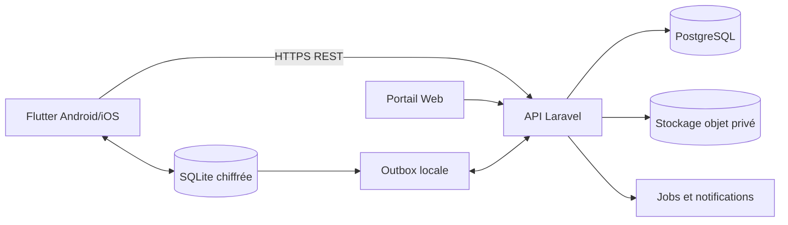

# Architecture cible

## Vue générale

Le portail Web sera réalisé avec Laravel Livewire afin d'accélérer le MVP tout
en conservant une architecture modulaire.

## Backend

- Laravel avec contrôleurs minces et services métier explicites.
- Policies et middleware pour les autorisations et le périmètre.
- PostgreSQL, contraintes, index et transactions.
- UUID pour les entités synchronisables.
- Registre immuable des mouvements de stock.
- Projections de soldes recalculables pour la performance.
- API versionnée sous `/api/v1`.
- Erreurs structurées et identifiants de corrélation.
- OpenAPI, tests d'autorisation et tests transactionnels.

## Mobile

- Flutter avec modules par domaine.
- Riverpod pour l'état, GoRouter pour la navigation et Dio pour HTTP.
- Séparation `presentation`, `application/domain` et `data` sans multiplier les
  couches sans bénéfice.
- SQLite chiffrée ; choix de la bibliothèque après POC Android/iOS.
- Référentiel local, outbox, curseurs de synchronisation et journal local.
- Stockage sécurisé des jetons via les mécanismes Android/iOS.

## Offline-First

### Principes

- L'interface lit d'abord la base locale.
- Une écriture terrain est validée localement dans une transaction.
- La même transaction ajoute une commande immuable dans l'outbox.
- Le moteur pousse les commandes avec une clé d'idempotence.
- Le serveur applique les règles et retourne les changements acceptés.
- Le client récupère ensuite les changements depuis son dernier curseur.

### Métadonnées minimales

- `id` UUID ;
- `organization_id` et périmètres nécessaires ;
- `device_id`, `created_by`, `updated_by` ;
- `created_at`, `updated_at`, `deleted_at` ;
- `version` pour la concurrence optimiste ;
- `sync_status`, `sync_attempts`, `last_synced_at` côté mobile.

### Résolution des conflits

| Situation | Règle initiale |
|---|---|
| Créations distinctes | Conserver les deux UUID |
| Rejeu de la même commande | Retourner le premier résultat grâce à l'idempotence |
| Référentiel central | Serveur autoritaire |
| Modification concurrente simple | Refuser avec conflit de version |
| Mouvement de stock validé | Ne jamais écraser ; mouvement compensatoire |
| Inventaire validé concurrent | Conflit critique et résolution manuelle |
| Suppression | Tombstone synchronisé |

Un POC doit tester deux appareils hors ligne réalisant des opérations sur le
même produit et le même lot.

## Sécurité

- TLS obligatoire.
- Jetons courts et révocables, associés à l'appareil.
- Données sensibles et fichiers privés avec accès temporaire contrôlé.
- Base locale et secrets protégés par les mécanismes natifs.
- Minimisation et durée de conservation des données patients.
- Audit des connexions, modifications, validations, exports, accès aux fichiers,
  changements de droits et résolutions de conflits.
- Aucune donnée d'une autre organisation ne doit être retournée, même si son
  identifiant est deviné.

## Android et iOS

Les fonctionnalités et critères d'acceptation sont communs. La CI devra produire
des builds Android et iOS. La livraison iOS nécessite un environnement macOS
avec Xcode, un compte Apple Developer, des certificats et des profils de
signature. Ces prérequis seront suivis comme dépendances du projet.
