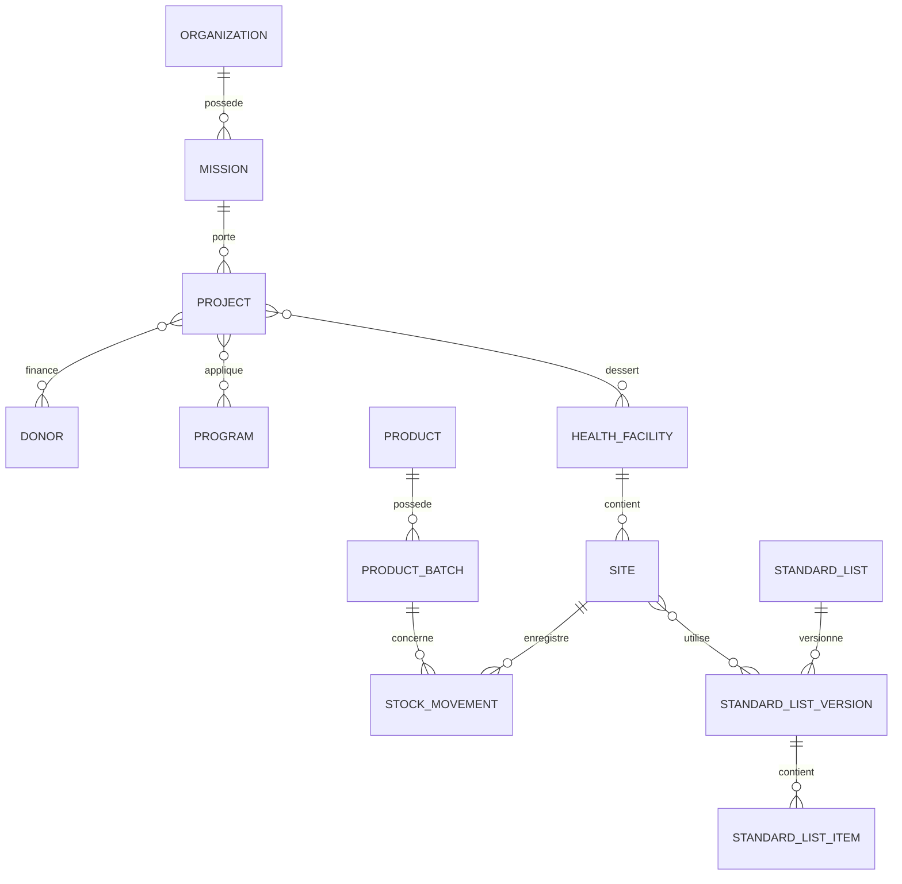

# Modèle conceptuel et dictionnaire des données

Statut : **référence conceptuelle V1 à valider avant migrations correctives**.

## Principes

- UUID pour toute donnée créée hors ligne.
- PostgreSQL est central ; SQLite est une projection locale par site.
- `site_id` est obligatoire sur toute opération locale de stock.
- Les mouvements validés, audits et synchronisations sont append-only.
- Le solde est une projection recalculable, jamais la source de vérité.
- Suppression logique des référentiels et comptes ; aucune suppression physique
  des transactions validées.
- Montants décimaux avec devise ; quantités décimales avec unité.

## Dictionnaire V1

| Entité/table | Finalité | Relations essentielles |
|---|---|---|
| `organizations` | ONG ou ministère | pays, missions |
| `countries` | Pays de référence | missions, protocoles |
| `missions` | Mission nationale | organisation, pays, projets |
| `projects` | Projet de santé | mission, bailleurs, programmes, structures |
| `donors` | Bailleur | organisation, projets |
| `programs` | Programme de santé | organisation, bailleur?, projets |
| `project_donors` | Financement | projet, bailleur, montant, devise |
| `program_project` | Affectation programme | projet, programme |
| `health_facilities` | Formation sanitaire | organisation, mission, soins, catégorie |
| `health_facility_project` | Affectation structure | formation sanitaire, projet |
| `sites` | Site stockage/dispensation | formation sanitaire |
| `users` | Compte personnel | sécurité, statut |
| `roles` | Cinq rôles officiels | niveau hiérarchique |
| `permissions` | Action atomique | code unique |
| `role_user` | Rôle et scope | utilisateur, rôle, type/id de scope |
| `permission_user` | Délégation locale | utilisateur, permission |
| `devices` | Appareil enregistré | utilisateur, révocation |
| `setup_progress` | Assistant initial | étape, état, validateur |
| `module_activations` | Modules actifs | module, scope |
| `project_supply_settings` | Approvisionnement | projet, délais, périodicité, tampon |
| `care_levels` | Niveaux de soins | pays, code |
| `target_populations` | Populations cibles | code, libellé |
| `pathologies` | Pathologies | pays, protocole/version |
| `product_categories` | Catégories produits | code, nom |
| `units` | Unités | code, précision |
| `suppliers` | Fournisseurs | organisation, code |
| `products` | Produit médical | code, DCI, dosage, conditionnement, unité, prix, GS1 |
| `standard_lists` | Liste standard logique | critères de génération |
| `standard_list_versions` | Version publiée | liste, version, validateur |
| `standard_list_items` | Articles autorisés | version, produit, prix, substitution |
| `site_standard_lists` | Affectation | site, version |
| `product_batches` | Lot physique | produit, expiration, origine, bailleur, projet, fournisseur |
| `receipts` | Réception | site, origine, commande?, statut |
| `receipt_items` | Ligne reçue | produit, lot, commandé, reçu, prix |
| `stock_movements` | Registre de stock | site, lot, type, quantité signée, source |
| `stock_balances` | Projection de solde | site, lot, quantité |
| `transfers` | Transfert | site origine/destination |
| `dispensations` | Sortie autorisée | site, type, patient/service, statut |
| `dispensation_items` | Ligne délivrée | produit, lot, quantité, substitution |
| `inventories` | Session d'inventaire | site, type, période, statut |
| `inventory_lines` | Comptage | lot, théorique, physique, écart |
| `orders` | Commande | site, projet, type, période, statut |
| `order_items` | Besoin | produit, CMM, disponible, proposé, validé |
| `alerts` | Alerte logistique | site, type, gravité, statut |
| `sync_operations` | File de synchronisation | appareil, site, entité, action, payload |
| `sync_conflicts` | Conflit | versions locale/serveur, résolution |
| `audit_logs` | Traçabilité | acteur, action, ressource, avant/après |

## Relations structurantes



## Source de vérité du stock

```text
transaction validée → mouvement immuable → projection du solde → alertes/rapports
```

Une correction crée un mouvement compensatoire.

## Projection SQLite d'un site

- profil, rôle, permissions et scope ;
- configuration du site ;
- référentiels et liste standard affectée ;
- lots et soldes du site ;
- transactions locales nécessaires ;
- file `sync_operations`, curseurs et conflits.

Le mobile ne télécharge aucune donnée opérationnelle d'un autre site.
