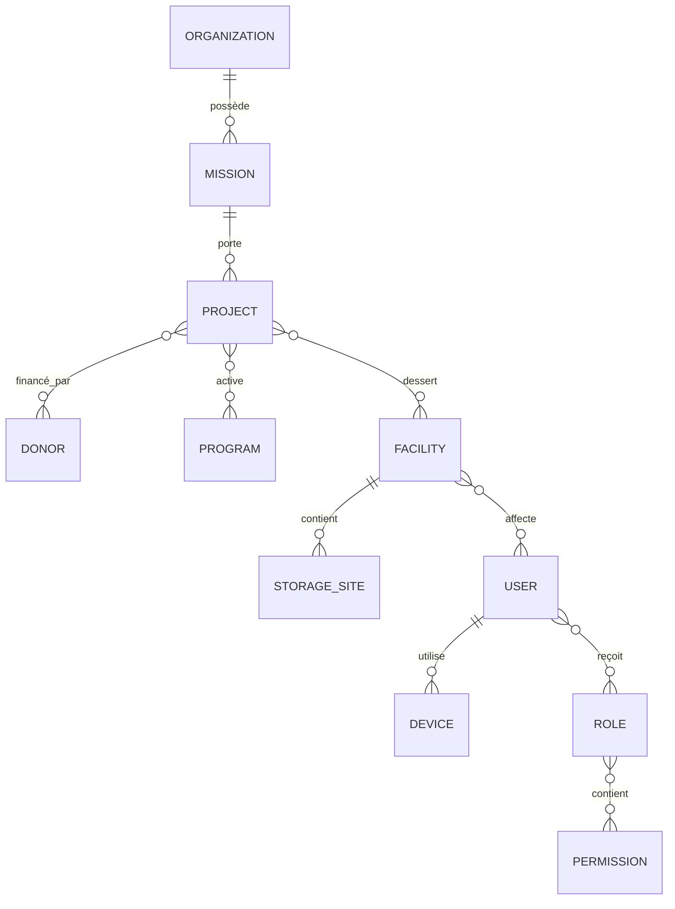
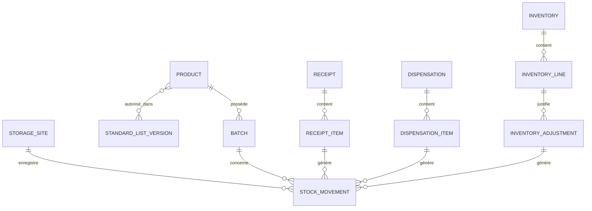
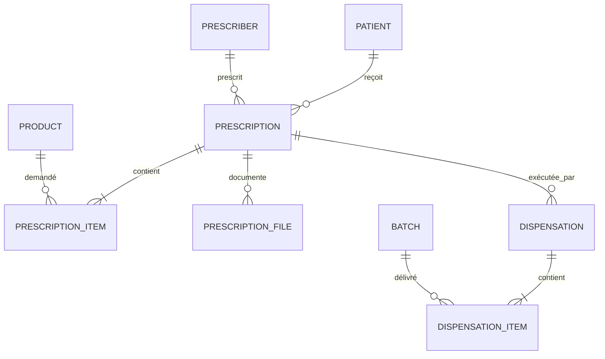

# Modèle conceptuel de données

Ce modèle est une base de validation. Il précède volontairement les migrations.

## Familles de tables

| Domaine | Tables principales |
|---|---|
| Identité | `users`, `roles`, `permissions`, `role_assignments`, `devices`, `sessions` |
| Organisation | `organizations`, `missions`, `countries`, `projects`, `donors`, `programs`, `project_donors` |
| Structures | `facilities`, `departments`, `storage_sites`, `facility_users` |
| Configuration | `feature_flags`, `project_settings`, `alert_thresholds`, `calculation_rule_versions` |
| Référentiels | `product_categories`, `units`, `dosage_forms`, `routes`, `pathologies`, `target_populations`, `suppliers` |
| Produits | `products`, `product_codes`, `kits`, `kit_items`, `batches` |
| Listes | `standard_lists`, `standard_list_versions`, `standard_list_items`, `facility_list_assignments` |
| Stocks | `stock_movements`, `stock_balances`, `transfers`, `quarantines`, `destructions` |
| Réceptions | `receipts`, `receipt_items`, `receipt_documents` |
| Patients | `patients`, `patient_identifiers`, `prescribers` |
| Ordonnances | `prescriptions`, `prescription_items`, `prescription_files` |
| Dispensations | `dispensations`, `dispensation_items`, `dispensation_returns` |
| Inventaires | `inventories`, `inventory_lines`, `inventory_adjustments`, `inventory_approvals` |
| Commandes | `orders`, `order_items`, `order_approvals`, `deliveries` |
| Alertes | `alert_rules`, `alerts`, `alert_acknowledgements` |
| Rapports | `report_runs`, `report_files`, `signatures`, `exports` |
| Formation | `training_contents`, `courses`, `course_progress`, `training_assessments` |
| Supervision | `supervisions`, `supervision_criteria`, `supervision_answers`, `recommendations` |
| Chaîne du froid | `cold_chain_equipment`, `temperature_readings`, `temperature_alerts` |
| Synchronisation | `sync_commands`, `sync_cursors`, `sync_conflicts`, `sync_logs`, `idempotency_keys` |
| Audit | `audit_logs`, `file_access_logs` |

## Principes d'intégrité

- UUID pour toute entité pouvant être créée hors ligne.
- Clés étrangères et contraintes d'unicité appliquées en base.
- `organization_id` obligatoire sur les données appartenant à une organisation.
- Montants en type décimal et devise explicite.
- Quantités en décimal avec précision adaptée à l'unité.
- Dates métier distinctes des dates techniques.
- Suppression logique ciblée ; aucune suppression physique d'un mouvement,
  inventaire validé, dispensation ou audit.
- Un mouvement validé est append-only.
- Un solde de stock est une projection ; il ne remplace pas le registre.
- Les règles de calcul portent un identifiant de version.

## ERD organisationnel

## ERD stock

## ERD patient et dispensation

## Questions de modélisation restantes

- Un bailleur finance-t-il directement un lot, une réception, une ligne de
  réception ou une combinaison de ces niveaux ?
- Une mission est-elle toujours limitée à un pays ?
- Une formation sanitaire peut-elle appartenir à plusieurs projets simultanés ?
- Quel identifiant patient doit être unique : plateforme, organisation, pays,
  projet ou formation sanitaire ?
- Une dispensation hors ligne réserve-t-elle le stock ou crée-t-elle
  immédiatement un mouvement de sortie local ?

