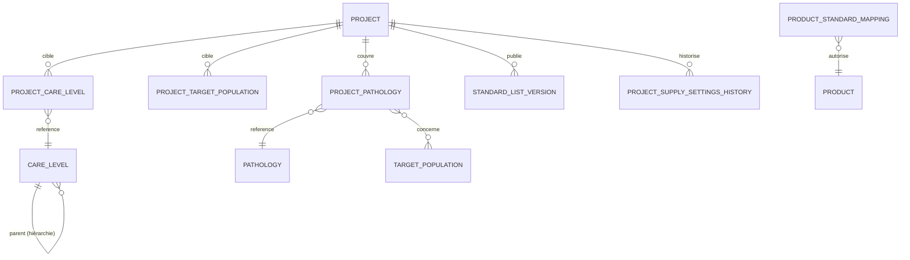

# Analyse du cahier des charges — Configuration Mission, Projet et Comptes

| | |
|---|---|
| **Date** | 30 septembre 2026 |
| **Portée** | Spécifications fonctionnelles « Configuration d'une mission », « Compte », et leur impact sur le module Admin Projet |
| **Sources** | Document de spécifications fonctionnelles PharmaCare (captures transmises), `docs/01`, `docs/03`, `docs/04`, `docs/15`, `docs/16`, `docs/18`, `docs/19` |
| **Base de code analysée** | Branche `master`, commit `e2e9b56` + modifications non commitées du 08–23/09 (refonte UI/Tailwind) |

---

## 1. Synthèse exécutive

Les spécifications transmises confirment l'orientation actuelle : l'**Admin
Projet est un administrateur contextuel**, rattaché à un seul projet, qui
**exploite** une configuration définie au-dessus de lui (Coordination / Sago).
Une bonne partie du socle existe déjà dans le code :

- rattachement de l'Admin Projet à un projet lors de sa création ;
- paramètres d'approvisionnement portés par le projet ;
- moteur de génération de liste standard multicritère (niveau de soins,
  population, pathologie, examen, catégorie de FOSA) ;
- restriction des droits d'écriture de l'Admin Projet sur la configuration.

Les écarts principaux sont de **modèle de données** et de **restitution** :

1. Les **niveaux de soins ne sont pas hiérarchiques** (Niveau → Catégorie →
   Programme n'est pas représentable).
2. **Populations cibles et pathologies ne sont pas rattachées au projet** :
   elles ne vivent que dans le contexte d'une version de liste standard.
3. **L'association Pathologie ↔ Population** exigée par la spécification
   n'existe pas en tant que telle.
4. La fiche projet ne porte ni **responsable**, ni **statut de cycle de vie**,
   ni **codes bailleur / programmes MoH** structurés.
5. L'écran **« Mon projet »** (mobile) n'affiche ni la configuration médicale,
   ni les indicateurs opérationnels, ni la **fiche FOSA** détaillée.

À cela s'ajoutent des **dettes transverses** qui conditionnent la mise en
production : 6 tests backend en échec au 30/09 (39 au 23/09), refonte UI non commitée,
décision JWT/Sanctum non tranchée, écrans Web encore provisoires.

**Recommandation :** stabiliser d'abord (tests + commit de la refonte UI), puis
livrer le modèle de configuration médicale du projet, puis enrichir « Mon
projet » et la fiche FOSA. Détail dans [03-backlog-ameliorations.md](03-backlog-ameliorations.md).

---

## 2. Règles métier extraites de la spécification

### 2.1 Création d'un projet (Admin Coordination)

| Réf. | Règle |
|---|---|
| RG-PRJ-01 | Un projet appartient à une **mission** choisie dans la liste des pays couverts. |
| RG-PRJ-02 | Le projet porte le **nom de l'organisation ou du programme** qui le met en œuvre. |
| RG-PRJ-03 | Le projet porte les **codes du bailleur** et les **codes programme MoH**. |
| RG-PRJ-04 | Le projet porte un **intitulé**. |
| RG-PRJ-05 | Le projet est associé à une **Standard List hiérarchique** : Niveau → Catégorie → Programme. |
| RG-PRJ-06 | Il doit être possible d'**ajouter de nouveaux niveaux de service**. |

Exemples fournis par la spécification :

```text
Niveau                      Catégorie / Programme
─────────────────────────   ───────────────────────────────
Soins de santé primaire     Programme PEC VIH
Soins de santé secondaire   Programme PEC Paludisme
                            Programme PEC Malnutrition
                            Programme PEC Tuberculose
```

### 2.2 Populations cibles et pathologies

| Réf. | Règle |
|---|---|
| RG-POP-01 | Le projet définit ses **populations cibles** (ex. Adultes, Femmes enceintes, Enfants < 5 ans). |
| RG-POP-02 | La liste des populations est un **référentiel configurable**, jamais codé en dur. |
| RG-PAT-01 | Le projet associe une **liste de pathologies aux populations ciblées**. |
| RG-PAT-02 | La liste de produits est **adaptée** au niveau de soins, à la population et aux pathologies sélectionnés. |

Conséquence d'architecture :

```text
Projet
 └── Niveau de soins (hiérarchique)
      └── Population cible
           └── Pathologie
                └── Produits autorisés  ← dérivés, versionnés, publiés
```

### 2.3 Paramètres d'approvisionnement

| Réf. | Règle |
|---|---|
| RG-APP-01 | Périodicité des commandes configurable (liste en mois). |
| RG-APP-02 | Délai de livraison configurable (liste en mois). |
| RG-APP-03 | Stock de sécurité configurable (liste en mois). |
| RG-APP-04 | Ces paramètres relèvent de la **configuration du projet**, pas du module Stock. |

Ils alimentent directement les formules de `docs/16` (pré-rupture, besoin de
commande).

### 2.4 Comptes utilisateurs

| Réf. | Règle |
|---|---|
| RG-CPT-01 | Un compte comporte trois rubriques : **Informations personnelles**, **Identifiant et sécurité**, **Rôle et niveau d'accès**. |
| RG-CPT-02 | L'Admin Coordination crée les comptes des projets, avec **certaines limitations de modification** ultérieures. |
| RG-CPT-03 | Si le rôle choisi est **Admin Projet**, seul le projet est à renseigner, via une **liste déroulante** alimentée par la configuration projet. |
| RG-CPT-04 | L'Admin Projet est **rattaché à un projet précis** ; son interface le récupère automatiquement, sans sélection manuelle. |

### 2.5 Périmètre de l'Admin Projet

```text
Organisation → Mission → Projet → Admin Projet
                                    └── FOSA / Sites
                                         └── Équipe FOSA
                                              └── Bénéficiaires → Dispensations → Stocks
```

| Réf. | Règle |
|---|---|
| RG-ADP-01 | L'Admin Projet **consulte** la configuration médicale et d'approvisionnement ; il ne la modifie pas. |
| RG-ADP-02 | Les référentiels structurants (Standard Lists, populations, pathologies) sont administrés par la **Coordination / Sago**. |
| RG-ADP-03 | L'Admin Projet **supervise** ses FOSA : informations, responsable, équipe, bénéficiaires, pathologies, médicaments, stock, dispensations, rapports. |
| RG-ADP-04 | L'Admin Projet gère les FOSA/sites de son projet et crée les Admin Site (`docs/04`). |

---

## 3. Matrice de conformité

Légende : ✅ conforme · 🟡 partiel · ❌ absent

### 3.1 Projet

| Règle | État | Constat dans le code | Amélioration |
|---|:---:|---|---|
| RG-PRJ-01 | ✅ | `projects.mission_id` obligatoire, contrôle d'appartenance à l'organisation | — |
| RG-PRJ-02 | 🟡 | Le projet est rattaché à `organization_id` ; aucun champ pour l'organisation/programme **de mise en œuvre** lorsqu'il diffère | AM-110 |
| RG-PRJ-03 | 🟡 | Bailleurs liés via `project_donors` avec `agreement_reference` ; programmes liés sans **code MoH** explicite | AM-110 |
| RG-PRJ-04 | ✅ | `projects.name` (180 car.) | — |
| RG-PRJ-05 | ❌ | `care_level` est un type plat de `catalog_references` : pas de parent, pas de niveau | AM-111 |
| RG-PRJ-06 | 🟡 | Ajout de niveaux possible via le CRUD référentiels, mais sans hiérarchie | AM-111 |
| Responsable, statut | ❌ | Seulement `is_active` ; pas de responsable ni de cycle brouillon/actif/suspendu/clôturé | AM-110 |

### 3.2 Configuration médicale

| Règle | État | Constat | Amélioration |
|---|:---:|---|---|
| RG-POP-01 | 🟡 | Les populations existent comme référentiel ; elles ne sont sélectionnées **qu'au moment de générer une liste standard** (`standard_list_versions.target_population_ids`, JSON) | AM-112 |
| RG-POP-02 | ✅ | Référentiel `target_population` configurable, global ou par organisation | — |
| RG-PAT-01 | ❌ | Aucune association Pathologie ↔ Population au niveau projet | AM-112 |
| RG-PAT-02 | 🟡 | `StandardListGenerationService` + `product_standard_mappings` filtrent par niveau, population, pathologie, examen et catégorie FOSA. Le critère « niveau de soins » est **unique** et obligatoire | AM-113 |
| Contexte stocké en JSON | 🟡 | `target_population_ids`, `pathology_ids` en JSON : pas d'intégrité référentielle, requêtes difficiles, peu adapté à PostgreSQL | AM-112 |

### 3.3 Approvisionnement

| Règle | État | Constat | Amélioration |
|---|:---:|---|---|
| RG-APP-01 à 03 | ✅ | `order_period_months`, `delivery_lead_time_months`, `safety_stock_months` (1 à 24) sur `projects` | — |
| RG-APP-04 | ✅ | Portés par le projet ; `docs/03` prévoyait `project_supply_settings`, l'écart est acceptable | AM-114 (doc) |
| Obligation | 🟡 | Champs `nullable` : un projet peut être actif sans paramètres, ce qui neutralise les formules de pré-rupture et de commande | AM-114 |
| Traçabilité | 🟡 | Modification non historisée : impossible de savoir quel paramètre s'appliquait à une commande passée | AM-114 |

### 3.4 Comptes

| Règle | État | Constat | Amélioration |
|---|:---:|---|---|
| RG-CPT-01 | 🟡 | Les champs existent (identité, identifiant, mot de passe, rôle) ; regroupement en trois rubriques à vérifier sur tous les formulaires Web et mobile | AM-120 |
| RG-CPT-02 | 🟡 | Création descendante contrôlée ; les « limitations de modification » ne sont **pas formalisées** (quels champs la Coordination peut modifier après création) | AM-121 |
| RG-CPT-03 | ✅ | `AuthController::createUser` exige `project_id` pour `project_admin`, filtré par `UserScopeService::projects()` | — |
| RG-CPT-04 | 🟡 | Rattachement via `role_user.scope_type = project`. À vérifier : absence de sélecteur de projet sur toutes les pages de l'Admin Projet | AM-122 |

### 3.5 Admin Projet

| Règle | État | Constat | Amélioration |
|---|:---:|---|---|
| RG-ADP-01/02 | ✅ | Migration `2026_08_27_081000` retire `projects.manage`, `funding.manage`, `standard_lists.manage`, `project_settings.manage` ; génération de liste réservée à `coordination_admin` | — |
| RG-ADP-03 | ❌ | « Mon projet » mobile affiche : informations générales, bailleurs, programmes, approvisionnement. **Absents** : configuration médicale, indicateurs, fiche FOSA détaillée | AM-130, AM-131 |
| RG-ADP-04 | 🟡 | FOSA et équipe FOSA accessibles (Web et mobile) ; vues de supervision FOSA (stock, dispensations, rapports) non consolidées | AM-131 |

---

## 4. Modèle de données cible proposé

Objectif : représenter la configuration médicale **au niveau du projet**, avec
intégrité référentielle, puis dériver les listes standards de cette
configuration.



| Changement | Nature | Remarque |
|---|---|---|
| `catalog_references.parent_id` (+ `level_depth`) pour `care_level` | Ajout de colonne | Permet Niveau → Catégorie → Programme sans nouvelle table ; contrôle anti-cycle côté service |
| `project_care_levels` | Nouvelle table pivot | Projet ↔ nœuds de la hiérarchie retenus |
| `project_target_populations` | Nouvelle table pivot | Remplace la sélection JSON ponctuelle |
| `project_pathologies` + `project_pathology_population` | Nouvelles tables pivot | Implémente RG-PAT-01 |
| `projects.implementing_partner`, `projects.responsible_user_id`, `projects.status` | Ajout de colonnes | `status` ∈ `draft`, `active`, `suspended`, `closed` ; `is_active` conservé et dérivé pendant la transition |
| `program_project.moh_code`, `project_donors.donor_project_code` | Ajout de colonnes | Codes bailleur/MoH explicites |
| `project_supply_settings_history` | Nouvelle table append-only | Valeurs, auteur, date d'effet |
| `standard_list_versions.*_ids` (JSON) | Dépréciation progressive | Remplacés par un instantané relationnel du contexte lors de la publication |

Toutes les tables utilisent des UUID, l'archivage logique et l'audit, comme
le reste du schéma.

---

## 5. Répartition des responsabilités

| Élément | Admin Sago | Admin Coordination | Admin Projet | Admin Site |
|---|:---:|:---:|:---:|:---:|
| Référentiel global des niveaux de soins, populations, pathologies | **Gérer** (standards plateforme) | Compléter pour son organisation | Voir | Voir |
| Hiérarchie Niveau → Catégorie → Programme | Gérer | Gérer | Voir | — |
| Configuration médicale du projet | Voir | **Gérer** | Voir | Voir (contexte) |
| Correspondance produit ↔ contexte | Voir | **Gérer** | Voir | — |
| Génération / publication de la liste standard | Voir | **Gérer** | Voir, affecter aux sites | Voir |
| Paramètres d'approvisionnement | Voir | **Gérer** | Voir | Voir |
| FOSA et sites du projet | Voir | Voir | **Gérer** | Voir / gérer son site |
| Comptes Admin Projet | Voir | **Créer** (projet en liste déroulante) | — | — |
| Comptes Admin Site | Voir | Voir | **Créer** | — |

Cette matrice est cohérente avec `docs/04` et la remarque de l'analyse
fonctionnelle : l'Admin Projet ne crée pas les éléments structurants.

---

## 6. Écarts transverses (hérités de l'audit Phase 2, revérifiés)

| Réf. audit | Sujet | État au 30/09 | Amélioration |
|---|---|---|---|
| P0-01 | JWT demandé, Sanctum utilisé | **Toujours ouvert** (`laravel/sanctum ^4.3`) | AM-100 |
| P0-04 | Base locale mobile | **Partiellement résolu** : base Drift (`LocalEntities`, `OfflineOperations`, `SynchronizationStates`, schéma v1) | AM-104 |
| P0-05 | Idempotence de la synchronisation | **Partiellement résolu** : `api_idempotency_keys` liée à la requête et à l'autorisation ; gestion des conflits à confirmer | AM-104 |
| P0-07 | Fiabilité des tests | **Ouvert** : 259 tests, **6 échecs** mesurés le 30/09 (39 au 23/09), voir `05` C-09 | AM-101 |
| — | Refonte UI/Tailwind (08–23/09) | **Non commitée** (≈ 50 fichiers modifiés, 8 nouveaux) | AM-102 |
| — | Modules Web provisoires | Rapports, Synchronisation, Paramètres, Paramètres projet/site, Journal d'activité servis par `ModulePlaceholderController` | AM-140 à AM-143 |
| — | Tests visuels | Admin Site et Utilisateur Site non testés visuellement | AM-103 |

---

## 7. Décisions à obtenir du porteur

| ID | Question | Recommandation |
|---|---|---|
| DEC-01 | Profondeur de la hiérarchie des niveaux de soins : 2 niveaux (Niveau → Programme) ou 3 (Niveau → Catégorie → Programme) ? | Modèle arborescent sans limite technique, limité à 3 niveaux par règle de validation |
| DEC-02 | « Programme PEC » dans la Standard List : est-ce le même objet que `programs` (programmes de financement) ? | Les distinguer : programme **clinique** (référentiel) ≠ programme **de financement** ; les relier facultativement |
| DEC-03 | Quels champs d'un compte l'Admin Coordination peut-il modifier après création (RG-CPT-02) ? | Modifiables : identité, téléphone, statut, projet. Non modifiables : e-mail/identifiant (sauf Sago), rôle (recréation) |
| DEC-04 | Terme d'interface : « Bénéficiaires » ou « Patients » ? Le glossaire (`docs/13`) ne tranche pas | « Bénéficiaires » dans les écrans de supervision, « Patient » dans la dispensation |
| DEC-05 | L'Admin Site est-il rattaché à un **site** ou à une **FOSA** entière (« Administrateur FOSA ») ? | À clarifier : le code a déjà scopé patients et ordonnances à la FOSA (migration du 01/09) |
| DEC-06 | Paramètres d'approvisionnement obligatoires pour activer un projet ? | Oui : bloquer le passage au statut `active` sans les trois paramètres |
| DEC-07 | JWT ou amendement officiel pour conserver Sanctum (P0-01) ? | Conserver Sanctum avec expiration et rotation, et amender la spécification |

---

### Décisions du porteur — 30/09/2026

Le porteur a validé les recommandations DEC-01, DEC-02, DEC-03, DEC-04,
DEC-06 et DEC-07 ci-dessus, ainsi que Q-1 à Q-7 de l'audit technique
(`05-audit-technique-v1.md`). **DEC-05 reste ouverte** : la recommandation
était une demande de clarification (Admin Site rattaché à un site ou à une
FOSA entière).

## 8. Séquencement recommandé

```text
Lot 0 — Stabilisation          AM-101, AM-102, AM-103        (prérequis)
Lot 1 — Modèle projet          AM-110, AM-111, AM-112, AM-114
Lot 2 — Génération des listes  AM-113
Lot 3 — Comptes                AM-120, AM-121, AM-122
Lot 4 — Supervision projet     AM-130, AM-131, AM-132
Lot 5 — Modules provisoires    AM-140 → AM-143
```

Chaque lot suit la définition de terminé de `docs/17` : migration, API,
permissions, Web, mobile, offline si concerné, tests et validation explicite
avant le lot suivant.
